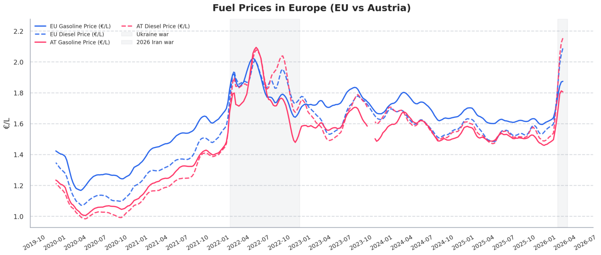

# ⚡🌍 Enerlytics — Energy Data Platform

A data-driven analytics platform for exploring European fuel markets, combining real-world EU data with time-series analysis, volatility tracking, and multi-country comparison.

This project demonstrates an end-to-end data workflow:

Data Ingestion → Transformation → Analysis → Visualization → Insights

---

## ✨ Features

* 🌍 Analyze real-world European fuel price data (EU Weekly Oil Bulletin)
* 🛢️ Track petrol (Euro 95) and diesel prices across the EU and member states (Austria)
* 📈 Time-series analysis of fuel price trends
* 📊 Compute key analytics:
  
  * Rolling averages (trend smoothing)
  * Price volatility (rolling standard deviation)
  * Fuel price spreads (diesel vs petrol)

* ⚡ Market regime detection (low / normal / high price environments)
* 🔥 Highlight key periods (e.g. 2022 energy crisis)
* 📉 Clean, publication-style visualizations
* 🧠 Modular and scalable project structure


## 🧱 Project Structure

```
enerlytics/
│
├── data/              # Raw input data (EU fuel prices)
├── src/               # Core logic
│   ├── extract.py
│   ├── transform.py
│   ├── visualization.py
│
├── outputs/           # Generated plots and results
├── app.py             # Streamlit dashboard (interactive)
├── main.py            # Script entry point
├── README.md
```

---

## 📸 Example Output



---

## ⚙️ Tech Stack

* Python 3.14
* Pandas (data processing & time-series analysis)
* NumPy (numerical computations)
* Matplotlib & Seaborn (visualization)
* Streamlit (interactive dashboard)

---

## ▶️ How to Run

```bash
pip install -r requirements.txt
python main.py
```

---

## 🧠 Analytical Focus

Enerlytics is designed to move beyond simple visualization and provide market-relevant insights, including:

* Trend detection (rolling averages)
* Volatility analysis (risk & instability signals)
* Cross-country comparisons (pricing divergence)
* Structural shifts (pre/post 2022 energy crisis)

---

## 📊 Example Insights Generated

* Identification of fuel price trends across European markets
* Comparison of national fuel prices vs EU average
* Detection of high-volatility periods (e.g. 2022 energy crisis)
* Analysis of diesel vs petrol price spreads
* Evaluation of market regimes based on historical benchmarks

---

## 🎯 Purpose

This project demonstrates:

* Working with real-world economic and energy data
* Structuring modular data pipelines (extract → transform → visualize)
* Applying time-series analysis techniques in Python
* Building analytical dashboards with Streamlit
* Translating raw data into actionable insights
  
---

## 🔮 Future Improvements

* Automated data ingestion (weekly EU updates)
* Forecasting models (time-series / ML)
* Interactive filtering (country / fuel type)
* API integration for additional energy datasets

---

## 📜 License

CC0-1.0
